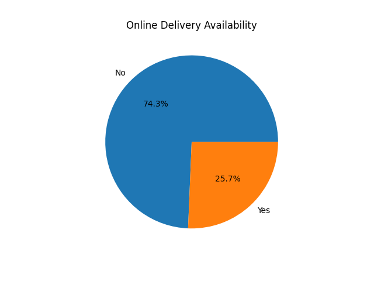

# COGNIFYZ - DATA ANALYSIS LEVEL 2 TASK 2

## 📌 Project Overview
This project focuses on analyzing online delivery services provided by restaurants. The analysis helps understand how restaurants adapt to digital food delivery trends and customer convenience.

---

## 🛠 Tools & Technologies Used
- Python
- Pandas
- Matplotlib

---

## 🎯 Objective
The objectives of this task are:
- Analyze online delivery availability
- Calculate percentage distribution
- Visualize online delivery trends
- Understand customer convenience services

---

## 📂 Dataset Description
The dataset contains restaurant information including:
- Restaurant names
- Online delivery availability
- Ratings
- Price ranges
- Table booking services
- Cuisine types

---

## ⚙️ Steps Performed
1. Loaded dataset using pandas
2. Counted restaurants providing online delivery
3. Calculated percentage distribution
4. Created pie chart visualization
5. Analyzed food delivery trends

---

## 📊 Data Visualization

### 🔹 Online Delivery Distribution

---

## 🔍 Key Insights
- Many restaurants now support online delivery services
- Online food delivery has become an important business feature
- Restaurants with delivery services can attract more customers
- Digital ordering improves customer convenience

---

## 📈 Business Recommendations
- Restaurants should adopt online delivery platforms
- Businesses can improve digital food ordering systems
- Delivery partnerships can increase restaurant sales

---

## ✅ Conclusion
Online delivery analysis helps understand modern restaurant business trends and customer preferences. Digital food delivery services play an important role in restaurant growth.